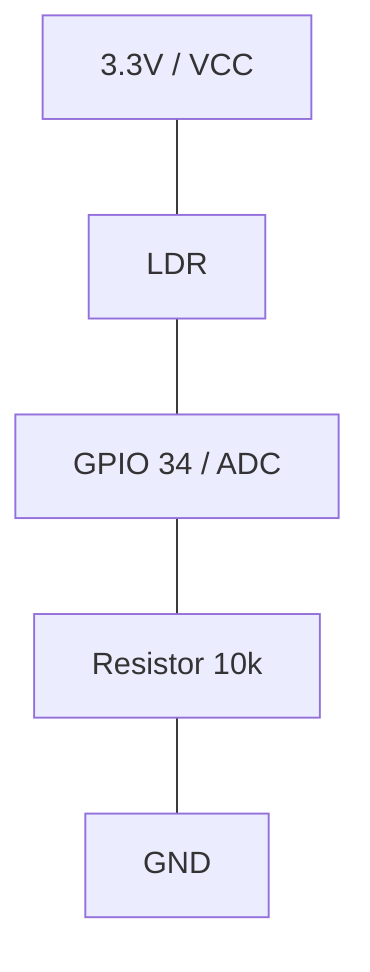

# LAB 05: Sensores e Comunicação Serial

---

### 🏛️ Mapeamento M3F (Multilayer Fog/Cloud)
*   **Camada Macro:** 🌿 Camada 1: Edge (Percepção Local)
*   **Nível de Referência:** 📍 Nível 1: Sensor/Atuador (Leitura Física Analógica e Digital)

```mermaid
graph TD
    C[Nuvem / Cloud API] <-->|Protocolo MQTT| F[Fog Server / Gateway Local]
    F <-->|Protocolo HTTP/MQTT| E[Edge Node / ESP32]
    subgraph Camada Edge (Percepção Local)
        E --- LDR[Sensor LDR / Luz]
        E --- DHT[Sensor DHT22 / Clima]
    end
    style E fill:#f9f,stroke:#333,stroke-width:2px
```

---

### 🔌 Hardware Requerido
*   **Placa:** **ESP32 DevKit v4**
*   **Finalidade:** Processamento em borda (Edge), I/O avançado e IoT

```mermaid
graph TD
    subgraph ESP32 DevKitC V4
        GPIO15[GPIO 15]
        GPIO34[GPIO 34]
        3V3[3V3]
        GND[GND]
    end
    subgraph Circuito LDR (Luminosidade)
        3V3 --- LDR[LDR]
        LDR --- GPIO34
        GPIO34 --- R1[Resistor 10k]
        R1 --- GND
    end
    subgraph Circuito DHT22 (Clima)
        3V3 --- DHT_VCC[VCC]
        GPIO15 --- DHT_SDA[SDA / Data]
        DHT_GND[GND] --- GND
    end
```

---

## 🚀 Como Iniciar?
1. Abra um projeto vazio para ESP32 (Arduino C++) no simulador: 🚀 <a href="https://wokwi.com/projects/new/esp32" target="_blank" title="Abrir em uma nova aba">**Projeto Vazio: ESP32 (Arduino)**</a>.
2. Se você está no navegador, siga o [**Guia de Início Rápido**](../../../guias_e_roteiros_tecnicos/Guia_Wokwi_Inicio_Rapido.md) para configurar seu hardware e documentação em segundos.

---

Aprendemos a coletar dados do ambiente usando sinais analógicos (LDR) e digitais (DHT22). A evolução aqui é o domínio da **escala**: de valores brutos para informações úteis.

---

## 🎯 Objetivos Técnicos
*   Leitura de Conversores Analógico-Digitais (ADC).
*   Uso de bibliotecas externas (DHT22).
*   Normalização de escalas com a função `map()`.

---

## 🧱 Setup de Hardware
Monte a base completa. Ela será usada em todos os níveis:
*   **DHT22 (Sensor Clima):** Pino 15.
*   **LDR (Luz):** Pino analógico 34 (ADC1_CH6).

#### 🔌 Divisor de Tensão do LDR (Lógica Direta)
Para que a leitura analógica seja diretamente proporcional à luz (valores maiores para ambientes mais claros), conectamos o LDR em pull-up e um resistor fixo de $10\text{ k}\Omega$ em pull-down:


*   **Escuridão**: LDR alta resistência ➡️ Pino lê próximo a 0V ➡️ ADC lê ~0 ➡️ 0%.
*   **Luz Intensa**: LDR baixa resistência ➡️ Pino lê próximo a 3.3V ➡️ ADC lê ~4095 ➡️ 100%.

---

## ⚙️ Workflow Passo a Passo

> [!IMPORTANT]
> **Substituição de Código**: Ao realizar cada etapa, substitua por completo o código antigo (ou a função correspondente) do seu arquivo no Wokwi para evitar erros de funções duplicadas no compilador.

### 🚀 Passo 1: O Mundo Analógico (LDR)
Começamos com a leitura bruta do LDR.

```cpp
// [TAG] DEFINICOES
const int pinoLDR = 34; // Pino analógico do LDR

void setup() {
  Serial.begin(115200);
  Serial.println("S122 - Estufa Iniciada!");
}

void loop() {
  // --- Etapa 1: Leitura Bruta ---
  int luzRaw = analogRead(pinoLDR);
  Serial.print("Bruta: "); 
  Serial.println(luzRaw);
  
  delay(500);
}
```

### 🚀 Passo 2: Normalização (Map)
Converta a leitura de 12 bits (0 a 4095) para escala percentual (0 a 100%).

```cpp
// [TAG] DEFINICOES
const int pinoLDR = 34;

void setup() {
  Serial.begin(115200);
  Serial.println("S122 - Estufa Iniciada!");
}

void loop() {
  int luzRaw = analogRead(pinoLDR);
  
  // --- Etapa 2: Conversao ---
  int luzPerc = map(luzRaw, 0, 4095, 0, 100);
  
  Serial.print("Luz %: "); 
  Serial.println(luzPerc);
  delay(500);
}
```

### 🚀 Passo 3: Integração DHT22
Acoplamos a leitura digital de clima usando a biblioteca oficial.

```cpp
// [TAG] DEFINICOES
#include <DHT.h>
const int pinoLDR = 34;
const int pinoDHT = 15;
DHT dht(pinoDHT, DHT22);

void setup() {
  Serial.begin(115200);
  Serial.println("S122 - Estufa Iniciada!");
  dht.begin(); 
}

void loop() {
  // --- Etapas 1 e 2: LDR ---
  int luzRaw = analogRead(pinoLDR);
  int luzPerc = map(luzRaw, 0, 4095, 0, 100);
  
  // --- Etapa 3: DHT22 ---
  float temp = dht.readTemperature();
  
  Serial.print("T: "); Serial.print(temp);
  Serial.print("C | L: "); Serial.print(luzPerc); 
  Serial.println("%");
  
  delay(2000); // Delay do DHT
}
```

### 🚀 Passo 4: Código Consolidado Final
Versão completa integrando temperatura, umidade e luminosidade.

```cpp
// [TAG] DEFINICOES
#include <DHT.h>
const int pinoLDR = 34;
const int pinoDHT = 15;
DHT dht(pinoDHT, DHT22);

void setup() {
  Serial.begin(115200);
  Serial.println("S122 - Estufa Iniciada!");
  dht.begin();
}

void loop() {
  // --- Etapas 1 e 2: LDR ---
  int luzRaw = analogRead(pinoLDR);
  int luzPerc = map(luzRaw, 0, 4095, 0, 100);
  
  // --- Etapa 3: DHT22 ---
  float temp = dht.readTemperature();
  float umid = dht.readHumidity();

  if (isnan(temp) || isnan(umid)) {
    Serial.println("Erro no DHT22!");
    delay(2000);
    return;
  }

  // [TAG] SAIDA_SERIAL
  Serial.printf("Luz: %d%% | T: %.1fC | U: %.1f%%\n",
                luzPerc, temp, umid);
  
  delay(2000); // Delay necessário
}
```

---

## 🌿 Conexão com o Projeto (Opcional)
Na **Estufa Inteligente**, este é o módulo de **Monitoramento Ambiental**. O DHT22 vigia a saúde térmica e o LDR decide se as plantas precisam de suplementação de luz.

---

## 🏭 Conexão com a Indústria (APL/RS)
*Este desafio faz parte da sua jornada de construção de uma solução real. Reflita:*
- No **APL de Vitivinicultura da Serra Gaúcha**, como o monitoramento de temperatura e umidade em tempo real pode evitar que uma safra de uva seja perdida por geada?

---

## 🧠 Atividades de Desafio Prático e Reflexão
Agora que você domina a leitura de sensores analógicos e digitais, aplique seu conhecimento em um cenário crítico de IoT!

### 🚨 Desafio: Alerta de Segurança e Mapeamento
*   **Missão:** Use a tag `[TAG] PROCESSAMENTO` para adicionar uma lógica condicional (`if`) que detecta condições críticas de estufa:
    1.  Se a temperatura for **maior que 35°C**, imprima uma mensagem de alerta no Monitor Serial: `[ALERTA DE SUPERAQUECIMENTO!] 🚨`.
    2.  Opcionalmente, observe a taxa de atualização dos sensores. Como o DHT22 precisa de $2\text{ s}$ para atualizar, o que acontece se tentarmos ler o sensor a cada $100\text{ ms}$?

### ❓ Reflexão Técnica (Obrigatória para Entrega)
1.  **Por que as tags de organização (como `[TAG] DEFINICOES`) são fundamentais** quando o código começa a crescer?
2.  Por que o comando `analogRead` no ESP32 retorna valores de $0$ a $4095$, enquanto no Arduino Uno clássico retornava de $0$ a $1023$? Como isso impacta a precisão das nossas medições de luminosidade?

---

## 📂 Solução de Referência e Recursos
O professor disponibilizou uma pasta chamada [**`solucao_referencia/`**](./solucao_referencia/) neste laboratório. Ela contém o circuito físico configurado e a lógica 100% implementada para o laboratório, bem como a resolução do desafio crítico. Use-a para validar sua lógica depois de tentar resolver sozinho!

---

## 🛣️ Bifurcação: Quer se tornar Pro?
Deseja versionar este código no seu GitHub? Siga o [**Guia Profissional de VS Code aqui.**](../90_GUIA_PROFISSIONAL_VSCODE/)

---

## 📤 Entrega (Classroom)
A sua entrega será avaliada pelos seguintes itens. Marque um check mental antes de enviar:
- [ ] **Link Wokwi:** O código deve conter o **Desafio: Alerta de Segurança** resolvido.
- [ ] **Log:** Captura de tela do Serial Monitor exibindo a telemetria (e o log de superaquecimento, se você forçou a temperatura acima de 35°C).
- [ ] **Respostas (Reflexão):** Responda as 2 perguntas da seção Reflexão Técnica na área de texto/comentários da entrega.

---
*UC S122 - Internet das Coisas*
