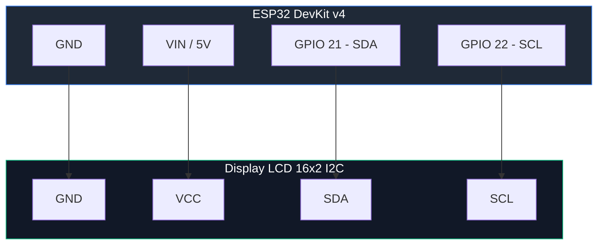

# LAB 06A: Interface LCD (Barramento I2C)
**Módulo 01: Fundamentos da Borda (Edge)**  

---

### 🏛️ Mapeamento M3F (Multilayer Fog/Cloud)
*   **Camada Macro:** 🌿 Camada 1: Edge (Percepção Local)
*   **Nível de Referência:** 📍 Nível 1: Sensor/Atuador (Display LCD e Barramento I2C)

---

### 🔌 Hardware Requerido e Conexões
*   **Placa:** **ESP32 DevKit v4**
*   **Display:** **LCD 16x2 com Módulo I2C**
*   **Finalidade:** Visualização local de dados no Edge

#### 📌 Diagrama de Ligação Física (I2C)
O display LCD I2C deve ser conectado ao barramento padrão
de pinos I2C do ESP32 (GPIO 21 e GPIO 22) conforme abaixo:



---

> [!IMPORTANT]
> **A Revolução do Clean Code na IoT:**
> Até agora, você escreveu seus códigos em um único arquivo (monolítico). Conforme adicionamos sensores, displays e futuramente WiFi e MQTT, o arquivo principal vira uma bagunça de "espaguete". Neste laboratório, você aprenderá a criar uma interface visual local (LCD) e, em seguida, fará a sua primeira **Transição Arquitetural**: fatiar o código monolítico em abas separadas baseadas na metodologia **M3F**!

---

## 🚀 Como Iniciar?
1. Abra um projeto vazio para ESP32 (Arduino C++) no simulador: 🚀 <a href="https://wokwi.com/projects/new/esp32" target="_blank" title="Abrir em uma nova aba">**Projeto Vazio: ESP32 (Arduino)**</a>.
2. Se você está no navegador, siga o [**Guia de Início Rápido**](../../../guias_e_roteiros_tecnicos/Guia_Wokwi_Inicio_Rapido.md) para configurar seu hardware e documentação em segundos.

---

## 🎯 Objetivos Técnicos
1.  Compreender o barramento de comunicação industrial **I2C**.
2.  Manipular a biblioteca `LiquidCrystal_I2C`.
3.  Exibir os dados climáticos captados pelo Edge de forma legível em uma interface local.

---

## 🧱 Setup de Hardware
Mantenha os sensores do **LAB 05** e adicione o display:
*   **ESP32 DevKit v4**
*   **DHT22 (Sensor Clima):** Pino 15.
*   **LDR (Luz):** Pino analógico 34.
*   **LCD 16x2 (I2C):** Pinos SDA (Pino 21 do ESP32) e SCL (Pino 22 do ESP32).

---

## ⚙️ Workflow Passo a Passo

### 🏗️ A Interface LCD (O Código Monolítico Base)
Vamos construir a solução clássica em um arquivo único (`sketch.ino`), unindo as leituras analógica/digital com a biblioteca do LCD I2C. Guarde este código, pois ele será a base do seu fatiamento no próximo Laboratório!

1.  No Wokwi, configure seu circuito com os componentes e crie o código abaixo no arquivo `sketch.ino`:

```cpp
#include <DHT.h>
#include <Wire.h>
#include <LiquidCrystal_I2C.h>

#define DHTPIN 15
#define DHTTYPE DHT22
#define LDRPIN 34

DHT dht(DHTPIN, DHTTYPE);
LiquidCrystal_I2C lcd(0x27, 16, 2);

void setup() {
  Serial.begin(115200);
  dht.begin();
  
  lcd.init();
  lcd.backlight();
  lcd.clear();
  lcd.setCursor(0, 0);
  lcd.print("Estufa IoT Monol");
  delay(1500);
}

void loop() {
  float temp = dht.readTemperature();
  float umid = dht.readHumidity();
  int luzRaw = analogRead(LDRPIN);
  
  // ADC do ESP32 vai até 4095
  int luzPerc = map(luzRaw, 0, 4095, 0, 100);

  if (isnan(temp) || isnan(umid)) {
    Serial.println("Erro de leitura!");
    return;
  }

  // Print Serial (Debug)
  Serial.printf(
    "T: %.1f C | U: %.1f %% | Luz: %d%%\n",
    temp, umid, luzPerc
  );

  // Print LCD (Visualização Local)
  lcd.clear();
  lcd.setCursor(0, 0);
  lcd.print("Temp: ");
  lcd.print(temp, 1);
  lcd.print(" C");
  
  lcd.setCursor(0, 1);
  lcd.print("Umid: ");
  lcd.print(umid, 1);
  lcd.print(" %");

  delay(2000);
}
```
2.  **Rode a simulação.** Verifique se a temperatura e a umidade aparecem perfeitamente no LCD.

---

### 🛣️ O que faremos a seguir?
No **LAB 06B**, você aprenderá como fatiar o código que você acabou de escrever em abas profissionais, preparando-o para as dezenas de linhas de configuração de redes e IoT que virão a seguir!

---

## 🌿 Conexão com o Projeto (Opcional)
Na **Estufa Inteligente**, o display representa a IHM (Interface Homem-Máquina) local. O agricultor que passa pelo equipamento no campo visualiza os dados climáticos instantaneamente, sem depender do Wi-Fi ou abrir aplicativos.

---

## 🏭 Conexão com a Indústria (APL/RS)
*Este desafio faz parte da sua jornada de construção de uma solução real. Reflita:*
- No **APL de Automação de Caxias do Sul**, por que IHMs locais são imperativas mesmo quando todas as máquinas enviam dados para uma nuvem centralizada?

---

## 🧠 Atividades de Desafio Prático e Reflexão
Agora que seu display I2C está funcionando, vamos testar sua capacidade lógica no código monolítico!

### 🚨 Desafio: Alerta Visual Direto na IHM
*   **Missão:** Altere seu código para exibir um alerta emergencial de forma automática.
    1.  Adicione uma estrutura condicional (`if/else`) logo após as leituras.
    2.  Se a temperatura registrada for **maior que 32°C**, o display deve ser limpo e exibir a mensagem `"ALERTA: QUENTE!"` na primeira linha.
    3.  Se a temperatura estiver abaixo ou igual a 32°C, o display deve operar normalmente mostrando Temperatura e Umidade.

### ❓ Reflexão Técnica (Obrigatória para Entrega)
1.  **A "Mágica" dos 2 Fios:** Displays LCD antigos exigiam até 16 pinos para funcionarem, ocupando quase todo o microcontrolador. O que o protocolo **I2C** fez e qual a função do pequeno "chip mochila" soldado na traseira do LCD para resolver isso usando apenas SDA e SCL?
2.  **O Problema do Flicker:** O que ocorre com os cristais líquidos se você remover completamente o `delay` do seu código e tentar reescrever os dados na tela milhares de vezes por segundo?

---

## 📂 Solução de Referência e Recursos
A pasta [**`solucao_referencia/`**](./solucao_referencia/) contém o circuito físico completo e o código monolítico com a lógica de Alerta Visual pronta.

---

## 🛣️ Próximo Passo
Seu display está lindo! Agora avance diretamente para o [**LAB 06B — Arquitetura M3F**](../LAB_06B_Arquitetura_M3F/), onde fatiar e limpar esse código!

---

## 📤 Entrega (Classroom)
A sua entrega será avaliada pelos seguintes itens. Marque um check mental antes de enviar:
- [ ] **Link Wokwi:** Link do simulador contendo o código monolítico e o **Desafio de Alerta Direto na IHM** implementado.
- [ ] **Print:** Captura de tela do display LCD mostrando a mensagem `"ALERTA: QUENTE!"`.
- [ ] **Respostas (Reflexão):** Responda as 2 perguntas da seção Reflexão Técnica na área de texto/comentários da entrega.

---
*UC S122 - Internet das Coisas*
