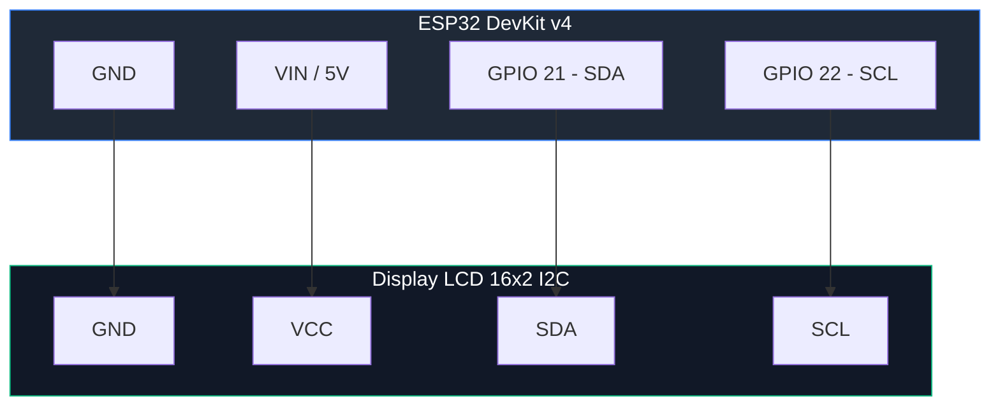
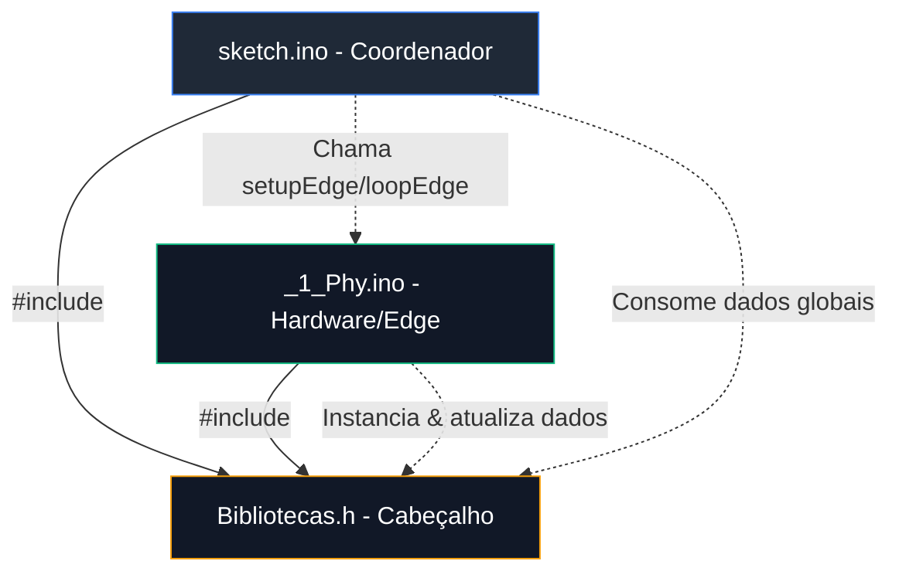

# LAB 06B: Transição Arquitetural (M3F Sliced)
**Módulo 01: Fundamentos da Borda (Edge)**  

---

### 🏛️ Mapeamento M3F (Multilayer Fog/Cloud)
*   **Camada Macro:** 🌿 Camada 1: Edge (Percepção Local)
*   **Nível de Referência:** 📍 Nível 1: Sensor/Atuador (Display LCD e Barramento I2C)

---

### 🔌 Hardware Requerido e Conexões
*   **Placa:** **ESP32 DevKit v4**
*   **Display:** **LCD 16x2 com Módulo I2C**
*   **Finalidade:** Visualização local de dados no Edge

#### 📌 Diagrama de Ligação Física (I2C)
O display LCD I2C deve ser conectado ao barramento padrão
de pinos I2C do ESP32 (GPIO 21 e GPIO 22) conforme abaixo:



---

> [!IMPORTANT]
> **A Revolução do Clean Code na IoT:**
> Até agora, você escreveu seus códigos em um único arquivo (monolítico). Conforme adicionamos sensores, displays e futuramente WiFi e MQTT, o arquivo principal vira uma bagunça de "espaguete". Neste laboratório, você aprenderá a criar uma interface visual local (LCD) e, em seguida, fará a sua primeira **Transição Arquitetural**: fatiar o código monolítico em abas separadas baseadas na metodologia **M3F**!

---

## 🚀 Como Iniciar?
1. Abra um projeto vazio para ESP32 (Arduino C++) no simulador: 🚀 <a href="https://wokwi.com/projects/new/esp32" target="_blank" title="Abrir em uma nova aba">**Projeto Vazio: ESP32 (Arduino)**</a>.
2. Se você está no navegador, siga o [**Guia de Início Rápido**](../../../guias_e_roteiros_tecnicos/Guia_Wokwi_Inicio_Rapido.md) para configurar seu hardware e documentação em segundos.

---

## 🎯 Objetivos Técnicos
1.  Compreender os problemas de escalabilidade do código monolítico em IoT.
2.  **Transição M3F:** Fatiar o firmware em arquivos modulares separando a Camada Física/Edge da inteligência central.
3.  Utilizar abas (`.h` e `.ino`) e a diretiva `extern` no Arduino IDE/Wokwi para compartilhamento de recursos.

---

## 🧱 Setup Inicial
Mantenha exatamente o mesmo hardware montado e o mesmo código final produzido no **LAB 06A**. 

---

## ⚙️ Workflow Passo a Passo

### 🪓 Passo 1: O Fatiamento M3F (A Transição para Abas)
Parabéns, seu código do LAB 06A funciona! Contudo, no **LAB 08 (WiFi)** teremos dezenas de linhas de rede, e no **LAB 11 (MQTT)** mais de 50 linhas de conexões e soquetes. Misturar isso com sensores e LCDs em um só arquivo causará bugs difíceis de rastrear.

Seguindo a **Metodologia M3F**, vamos fatiar esse código em **3 abas físicas** no Wokwi para separar a **Camada Física/Edge** das outras regras.

#### 🏛️ Arquitetura e Dependências de Software (M3F)
O organograma a seguir ilustra a separação de responsabilidades
e a hierarquia de inclusões no firmware fatiado:



#### Passo 1: Criar a aba `Bibliotecas.h`
Clique no botão de adicionar arquivo no Wokwi (ou crie no VS Code) e nomeie como `Bibliotecas.h`. Mova para lá todas as inclusões de bibliotecas, definições de pinos e declarações de variáveis globais que serão compartilhadas usando `extern`:

```cpp
// --- Bibliotecas.h ---
#ifndef _BIBLIOTECAS_H_
#define _BIBLIOTECAS_H_

#include <DHT.h>
#include <Wire.h>
#include <LiquidCrystal_I2C.h>

#define DHTPIN 15
#define DHTTYPE DHT22
#define LDRPIN 34

// Objetos globais (extern para acesso compartilhado)
extern DHT dht;
extern LiquidCrystal_I2C lcd;

// Variáveis globais de dados
extern float temp;
extern float umid;
extern int luzPerc;

#endif
```

#### Passo 2: Criar a aba `_1_Phy.ino` (Camada Física / Edge)
Crie uma nova aba chamada `_1_Phy.ino`. Este arquivo conterá apenas a lógica física de sensoriamento, atuação e exibição no display LCD, isolando o hardware local no Edge:

```cpp
// --- _1_Phy.ino ---
#include "Bibliotecas.h"

// Instanciação física no contexto do hardware (Edge)
DHT dht(DHTPIN, DHTTYPE);
LiquidCrystal_I2C lcd(0x27, 16, 2);

float temp = 0.0;
float umid = 0.0;
int luzPerc = 0;

void setupEdge() {
  dht.begin();
  lcd.init();
  lcd.backlight();
  lcd.clear();
  lcd.setCursor(0, 0);
  lcd.print("Estufa Sliced!");
  delay(1500);
}

void loopEdge() {
  temp = dht.readTemperature();
  umid = dht.readHumidity();
  int luzRaw = analogRead(LDRPIN);
  luzPerc = map(luzRaw, 0, 4095, 0, 100);

  if (isnan(temp) || isnan(umid)) {
    Serial.println("Erro no DHT22!");
    return;
  }

  // Exibição local no display LCD
  lcd.clear();
  lcd.setCursor(0, 0);
  lcd.print("Temp: ");
  lcd.print(temp, 1);
  lcd.print(" C");
  
  lcd.setCursor(0, 1);
  lcd.print("Umid: ");
  lcd.print(umid, 1);
  lcd.print(" %");
}
```

#### Passo 3: Limpar o arquivo principal `sketch.ino`
Agora, o seu arquivo principal se torna o **Coordenador Geral** do sistema, mantendo a estrutura limpa, sem detalhes de hardware e sem riscos de linkagem:

```cpp
// --- sketch.ino ---
#include "Bibliotecas.h"

// Declaração das funções do Edge
void setupEdge();
void loopEdge();

void setup() {
  Serial.begin(115200);
  Serial.println(
    "--- [M3F] Inicializando Sistema Sliced ---"
  );
  
  setupEdge(); // Inicializa sensores e LCD
}

void loop() {
  loopEdge(); // Executa leitura física local
  
  // Debug Serial
  Serial.printf(
    "[Debug] T: %.1fC | U: %.1f%% | Luz: %d%%\n",
    temp, umid, luzPerc
  );
  
  delay(2000);
}
```

---

### 🧪 Passo 3: Teste e Validação
1.  Execute a simulação com as 3 abas ativas.
2.  Verifique se o display continua mostrando a temperatura e umidade exatamente igual ao monolítico.
3.  **Reflexão:** Note como o `loop()` do seu arquivo principal ficou limpo e fácil de ler. 

---

## 🌿 Conexão com o Projeto (Opcional)
Na **Estufa Inteligente**, a modularização fatiada representa a arquitetura corporativa real: se amanhã precisarmos trocar o WiFi por LoRa, ou o sensor DHT22 por um termopar analógico, alteramos **apenas a aba correspondente**, sem quebrar ou precisar reescrever o código inteiro!

---

## 🏭 Conexão com a Indústria (APL/RS)
*Este desafio faz parte da sua jornada de construção de uma solução real. Reflita:*
- No **APL de Automação de Caxias do Sul**, por que sistemas industriais usam bibliotecas modulares e isoladas em vez de códigos monolíticos para gerenciar painéis de IHMs?

---

## 🧠 Atividades de Desafio Prático e Reflexão
Agora que seu código está fatiado de forma profissional, vamos realizar uma alteração e testar a modularidade do seu projeto!

### 🚨 Desafio: Alerta Visual Modular
*   **Missão:** Adicione um LED Vermelho de alerta ao circuito (no **pino 12**).
    1.  Abra a aba `Bibliotecas.h` e defina o pino do LED (`#define PINO_LED_ALERTA 12`).
    2.  Na aba `_1_Phy.ino`, configure o pino do LED como `OUTPUT` no `setupEdge()`.
    3.  Ainda em `_1_Phy.ino`, no `loopEdge()`, implemente a lógica para acender o LED se a temperatura ultrapassar **32°C**. Caso contrário, o LED deve apagar.
    4.  **Reflexão de Arquitetura:** Observe como você realizou toda a manutenção de hardware e lógica do LED nas abas físicas sem precisar alterar sequer uma linha no arquivo coordenador principal `sketch.ino`!

### ❓ Reflexão Técnica
1.  **Qual a grande utilidade do comando `extern`** na declaração de objetos e variáveis dentro de `Bibliotecas.h`? Como isso impede o erro de duplicidade de compilação (*multiple definition*)?
2.  Como a arquitetura M3F em abas ajuda uma equipe de desenvolvimento real de IoT a trabalhar em paralelo (ex: um desenvolvedor na nuvem e outro nos sensores)?

---

## 📂 Solução de Referência e Recursos
O professor disponibilizou uma pasta chamada [**`solucao_referencia/`**](./solucao_referencia/) neste laboratório. Ela contém o circuito físico completo montado e o firmware fatiado em abas 100% resolvido, incluindo o desafio do LED de alerta. Use-a para validar sua lógica depois de tentar fazer por conta própria!

---

## 📤 Entrega (Classroom)
*   **Link Wokwi:** Link do simulador (com as abas separadas).
*   **Captura de tela:** Imagem do editor mostrando as abas `sketch.ino`, `Bibliotecas.h` e `_1_Phy.ino` funcionais.

---
*UC S122 - Internet das Coisas*
